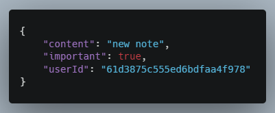
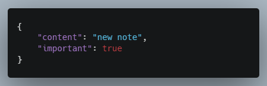

# Personal portfolio

## Notes:

For now the API Tester, in the request field, the data needs to be written in JSON format (with double quotes and without trailing commas).

### Examples of requests:

#### GET all:

URI: http://localhost:3001/api/notes

#### GET one:

URI: http://localhost:3001/api/notes/id

#### POST:

URI: http://localhost:3001/api/notes

#### PUT:

URI: http://localhost:3001/api/notes/id

#### DELETE:

URI: http://localhost:3001/api/notes/id
